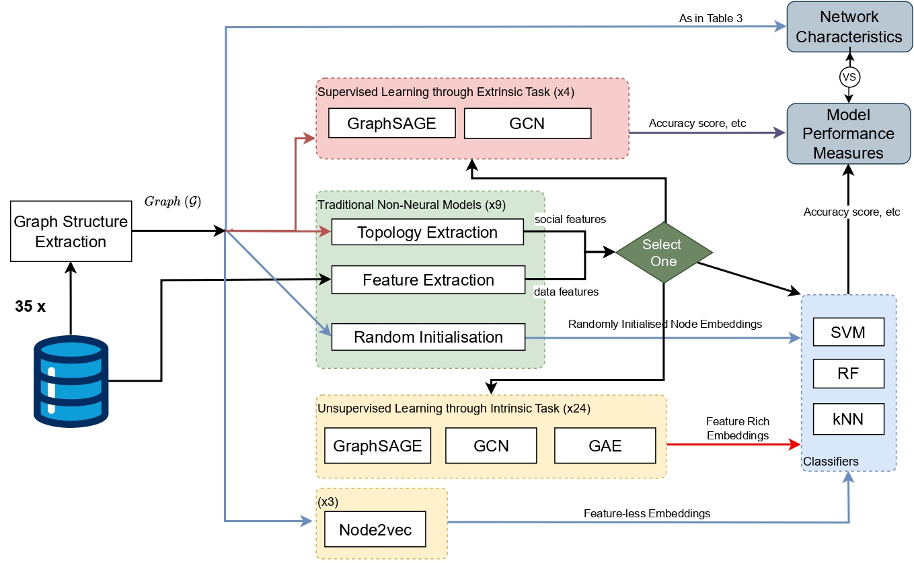
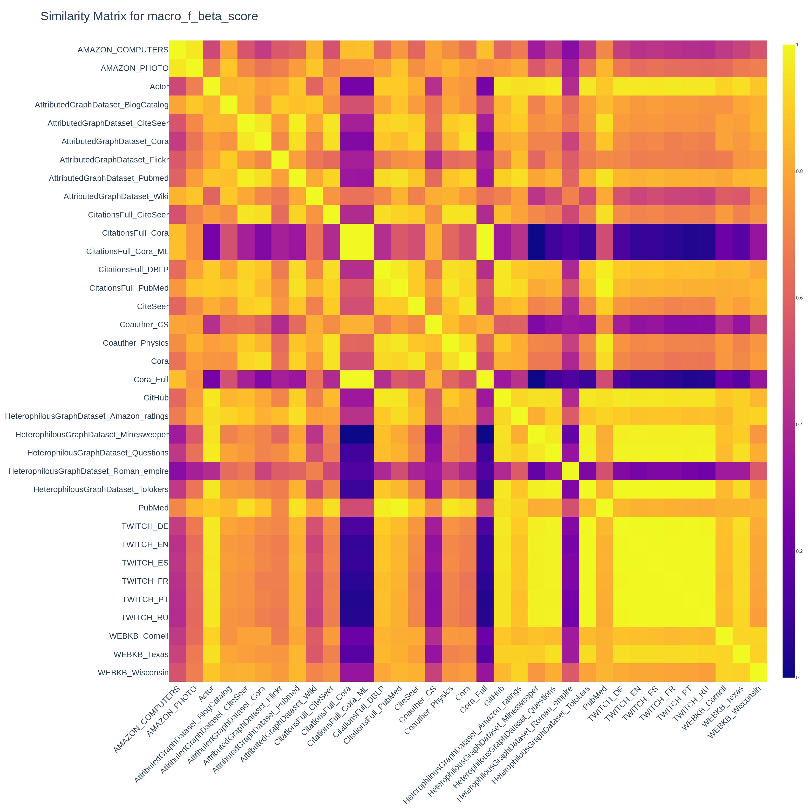
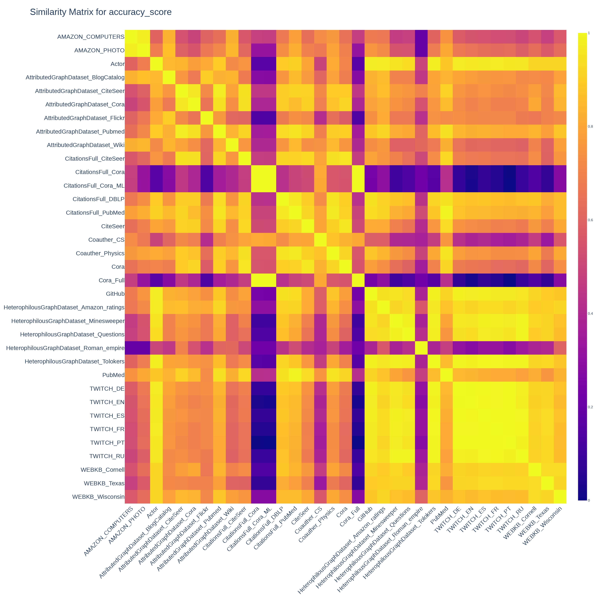
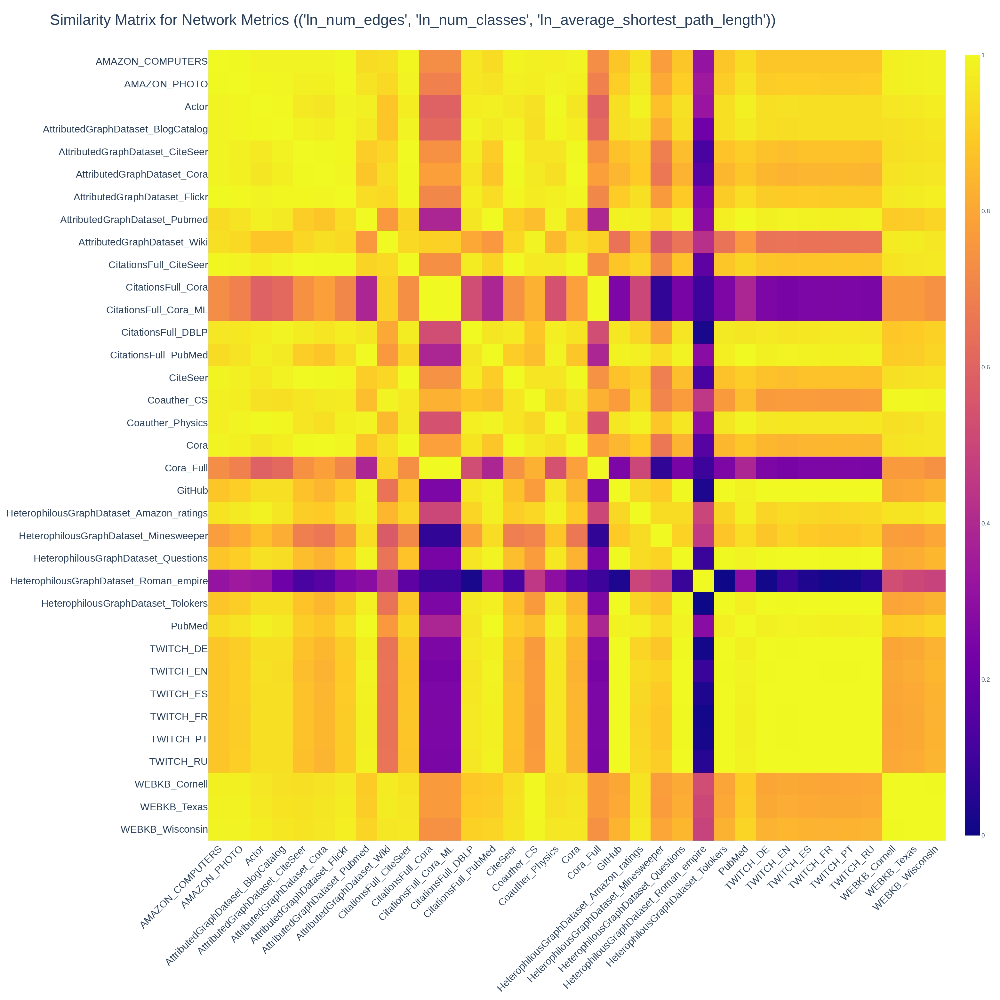

# PAKDD

This is the Code and Datasets for the paper

**"Are Graph Embeddings the Panacea? – an Empirical Survey from the Data Fitness Perspective"**

accepted by PAKDD 2024.

## Datasets

We have used the following datasets in our experiments:

    "Actor"
    "AMAZON_COMPUTERS"
    "AMAZON_PHOTO"
    "AttributedGraphDataset_BlogCatalog"
    "AttributedGraphDataset_CiteSeer"
    "AttributedGraphDataset_Cora"
    "AttributedGraphDataset_Flickr"
    "AttributedGraphDataset_Pubmed"
    "AttributedGraphDataset_Wiki"
    "CitationsFull_CiteSeer"
    "CitationsFull_Cora"
    "CitationsFull_Cora_ML"
    "CitationsFull_DBLP"
    "CitationsFull_PubMed"
    "CiteSeer"
    "Coauther_CS"
    "Coauther_Physics"
    "Cora"
    "Cora_Full"
    "GitHub"
    "HeterophilousGraphDataset_Amazon_ratings"
    "HeterophilousGraphDataset_Minesweeper"
    "HeterophilousGraphDataset_Questions"
    "HeterophilousGraphDataset_Roman_empire"
    "HeterophilousGraphDataset_Tolokers"
    "PubMed"
    "TWITCH_DE"
    "TWITCH_EN"
    "TWITCH_ES"
    "TWITCH_FR"
    "TWITCH_PT"
    "TWITCH_RU"
    "WEBKB_Cornell"
    "WEBKB_Texas"
    "WEBKB_Wisconsin"

## Experiment Design



## Results

Similarity matrices for: F1 score (left), Accuracy score (middle), Network Parameters (|E|, K, L) (right).


<p align="center">
  
  
  
</p>

## Reproduce the Results

### Setup

1. Clone the repository
2. Setup the conda environment
   ```bash
   conda create -n PAKDD-481 python=3.8
   conda activate PAKDD-481
   pip3 install torch torchvision torchaudio --index-url https://download.pytorch.org/whl/cu118 # install pytorch
   pip install git+https://github.com/pyg-team/pytorch_geometric.git  # install pytorch geometric
   pip install pyg_lib torch_scatter==1.4.0 torch_sparse torch_cluster torch_spline_conv -f https://data.pyg.org/whl/torch-2.2.0+cpu.html  
   pip install -r requirements.txt
   ```

3. Calculate the network characteristics
   First start the docker container with the following command:
   ```bash
   docker-compose up
   ```
   Then run the following command to calculate the network characteristics:
   ```bash
   python3 -m graph_metrics.dataset_network_metrics
   ```

4. Run the experiments
   ```bash
   bash ./scripts/all_datasets.sh
   ```

## Citation

```
@InProceedings{10.1007/978-981-97-2253-2_32,
author="Sun, Qiang
and Huynh, Du Q.
and Reynolds, Mark
and Liu, Wei",
editor="Yang, De-Nian
and Xie, Xing
and Tseng, Vincent S.
and Pei, Jian
and Huang, Jen-Wei
and Lin, Jerry Chun-Wei",
title="Are Graph Embeddings the Panacea?",
booktitle="Advances in Knowledge Discovery and Data Mining",
year="2024",
publisher="Springer Nature Singapore",
address="Singapore",
pages="405--417",
abstract="Graph representation learning has emerged as a machine learning go-to technique, outperforming traditional tabular view of data across many domains. Current surveys on graph representation learning predominantly have an algorithmic focus with the primary goal of explaining foundational principles and comparing performances, yet the natural and practical question ``Are graph embeddings the panacea?'' has been so far neglected. In this paper, we propose to examine graph embedding algorithms from a data fitness perspective by offering a methodical analysis that aligns network characteristics of data with appropriate embedding algorithms. The overarching objective is to provide researchers and practitioners with comprehensive and methodical investigations, enabling them to confidently answer pivotal questions confronting node classification problems: 1) Is there a potential benefit of applying graph representation learning? 2) Is structural information alone sufficient? 3) Which embedding technique would best suit my dataset? Through 1400 experiments across 35 datasets, we have evaluated four network embedding algorithms -- three popular GNN-based algorithms (GraphSage, GCN, GAE) and node2vec -- over traditional classification methods, namely SVM, KNN, and Random Forest (RF). Our results indicate that the cohesiveness of the network, the representation of relation information, and the number of classes in a classification problem play significant roles in algorithm selection.",
isbn="978-981-97-2253-2"
}

```
